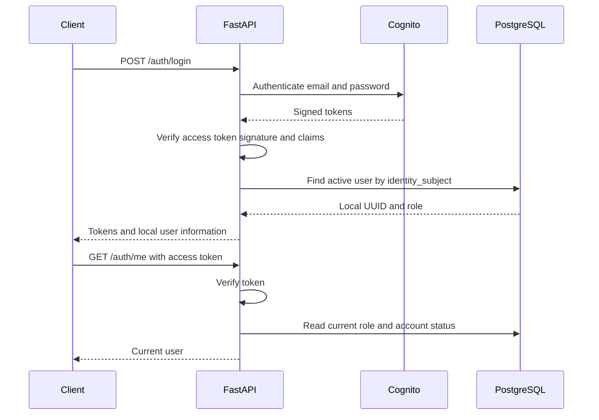

# Identity and Cognito

This module provides shared authentication for the product features. Cognito owns
passwords, confirmation codes and tokens. PostgreSQL owns the local user UUID,
role and account status. `app_user.identity_subject` is the opaque identifier
returned by the provider. It is unique and may be null for unlinked seed users.
There is no local password or hash fallback.

Company and professional registration are separate features. This PR does not
include CNPJ validation, BrasilAPI, company registration endpoints or their tests.

## Boundaries

| File or module | Responsibility |
| --- | --- |
| `app/identity/provider.py` | Provider-independent registration, authentication, token verification and email confirmation |
| `app/identity/integrations/cognito.py` | Cognito SDK calls and RS256/JWKS validation |
| `app/identity/dependencies.py` | Select the configured adapter |
| `app/auth/services/login.py` | Authenticate and find the local user by the verified subject |
| `app/auth/dependencies.py` | Read local account status and enforce role/approval requirements |
| `app/accounts/router.py` | Send/confirm provider email codes; no product registration logic |
| `infra/cognito` | AWS configuration and public environment identifiers |

Product use cases receive `IdentityProvider` through dependency injection. They
call `register(email=..., password=...)` and persist the returned `identity_subject`
with their own local user/profile transaction. Do not import boto3 into those
features or link accounts by matching emails alone. A retry can recover an existing
confirmed identity only after password authentication and token verification.
The feature owns persistence failure handling; there is no distributed transaction
or automatic deletion of provider users in this module.

One issuer and app client are configured per environment. Supporting multiple
issuers requires identifying accounts by issuer and subject together. Changing
pool configuration alone does not migrate existing identities.

## API contracts

All paths start with `/api/v1`. Inspect full schemas in `/docs`.

| Endpoint | Request | Success |
| --- | --- | --- |
| `POST /auth/login` | `email`, `password` | `200`: tokens, `expires_in`, `token_type`, local `user_id` and `user_type` |
| `GET /auth/me` | Bearer access token | `200`: `id`, `user_type`, nullable `company_status` |
| `POST /email-verification/confirm` | `email`, `code` | `204`, no body |
| `POST /email-verification/send` | `email` | `202`, no body; unknown/already confirmed addresses use the same response |



Use the access token for API calls. ID tokens are rejected. The adapter checks
RS256, a fixed issuer, expiration, issuance time, client ID, `token_use=access`
and a nonempty subject. PyJWT caches the issuer's public signing keys. A token
cannot select its own key-server URL. Responses containing identity data use
`Cache-Control: no-store`.

A valid provider account must also have a linked, active `app_user`. Suspended
and blocked local accounts receive `403`. `get_current_user` reads status on each
request. Product endpoints opt into `require_administrator` or
`require_approved_company` where appropriate. Pending companies may call `/auth/me`
to see their status. No public endpoint grants an administrator role.

Errors use `application/problem+json` with `code`, `detail`, `request_id` and optional
`errors: {field: [messages]}`. Invalid credentials/token return `401`, restricted
access returns `403`, unconfirmed email returns `409`, invalid/expired confirmation
code or password-policy violations return `422`, throttling returns `429`, and
provider unavailability returns `503`. Pydantic validation keeps the existing
`body.field` location convention. Missing pool/client configuration fails identity
operations with `503`; `/health` is independent and `/ready` only checks PostgreSQL.

Email confirmation returns the same `422 invalid_verification_code` response for
an invalid/expired code, an unknown account or a confirmation rejected because the
account is already confirmed. The error belongs to `errors.code`, without a
`WWW-Authenticate` header or a password error. This keeps those account states
indistinguishable in the response and avoids treating confirmation as an expired
login session. Login still returns `401` for invalid credentials.

## Configuring a developer environment

The shared development pool and backend client exist in Ohio. Public IDs are in
[`infra/cognito/environment.json`](../infra/cognito/environment.json). The client secret is private:
retrieve it through an authorized AWS console session and keep it only in your
backend `.env`. Do not create another pool for each developer.

From the backend root:

```bash
uv sync --frozen
cp .env.example .env
# Fill COGNITO_USER_POOL_ID, COGNITO_CLIENT_ID and COGNITO_CLIENT_SECRET.
# Point DATABASE_URL at your local PostgreSQL, then:
uv run alembic upgrade head
uv run uvicorn app.main:app --reload --no-access-log
```

Cognito needs `COGNITO_REGION=us-east-2`. The application uses public Cognito
operations and does not need IAM credentials; IAM access is for infrastructure
operators. Never put the client secret in `VITE_*`, query keys, logs or URLs.

The local seed is synthetic and has no login credentials. To test a seeded user,
an operator must explicitly link that local user's UUID to its verified provider
subject. Do not auto-link arbitrary accounts by email. The prepared WSL environment
has three synthetic test identities linked in a separate local database; their
passwords are stored privately outside the repository. They were confirmed
administratively, with email sending suppressed.

For a manual check, log in through `/docs`, authorize with the returned access token
and call `/auth/me`. Expect the local user's role. Try an ID token or wrong password
and expect `401`. Email delivery to a tester-controlled mailbox remains a separate
check; administrative confirmation does not prove email delivery.

## Validation and remaining work

```bash
uv run python scripts/validate.py
# Only with DATABASE_URL set to a separate disposable test database:
RUN_DATABASE_INTEGRATION_TESTS=1 uv run python scripts/validate.py
```

Tests isolate Cognito configuration even if `.env` contains real credentials.
They use Stubber, synthetic RSA keys and an isolated PostgreSQL. Live smoke checks
are performed separately, never as part of CI. Migration `d21b63ce9810` removes
`password_hash` and adds the unique subject. The original migration is unchanged.
Downgrade refuses a nonempty `app_user` table because it cannot reconstruct passwords.

The frontend main still has no authentication screens. Its integration should use
the shared API client and feature hooks: login/confirmation are mutations and
`/auth/me` is a query. Keep tokens out of persisted query caches and clear user data
when changing accounts. This API returns JSON tokens, not session cookies.
Refresh/logout, password reset, MFA challenge handling and browser session storage
remain separate work. Offline JWT verification does not detect token revocation
before expiration; local account blocking is checked on every protected request.

References: [Cognito JWT verification](https://docs.aws.amazon.com/cognito-user-identity-pools/latest/DeveloperGuide/amazon-cognito-user-pools-using-tokens-verifying-a-jwt.html),
[signup and confirmation](https://docs.aws.amazon.com/cognito-user-identity-pools/latest/DeveloperGuide/signing-up-users-in-your-app.html),
[token revocation](https://docs.aws.amazon.com/cognito-user-identity-pools/latest/DeveloperGuide/token-revocation.html).
